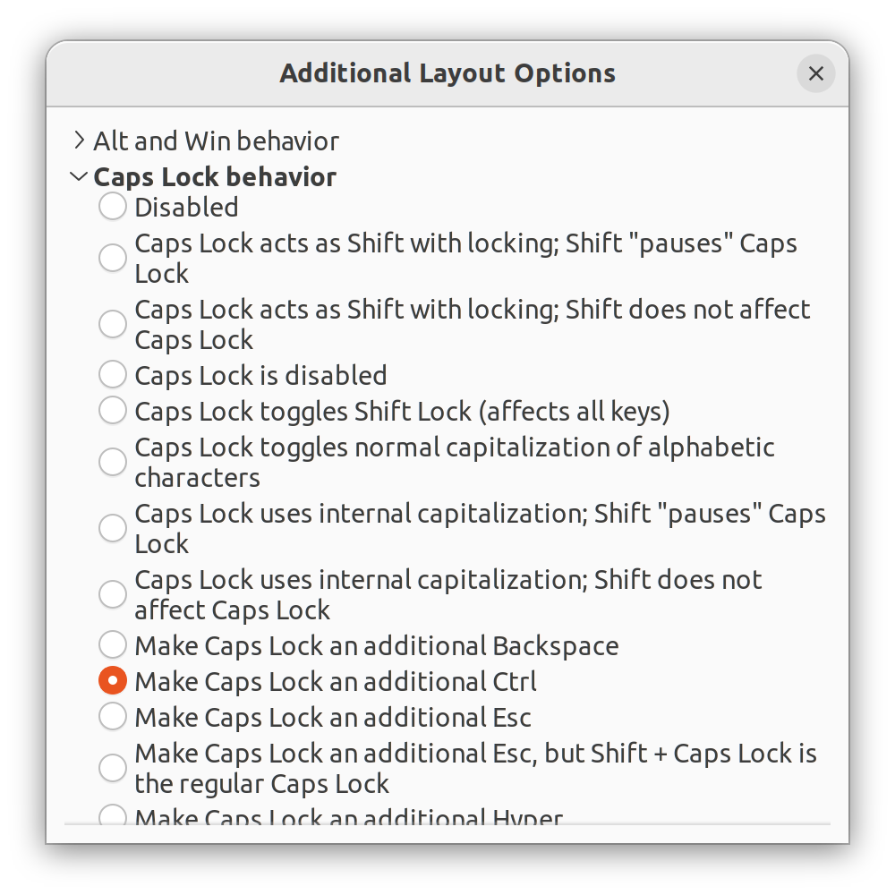

# Efficiency 11
# Make Caps Lock an additional Ctrl

## Author: Ruinan Lin
## Date: Feb 8, 2026

### Problem Description

We use `Ctrl` and `Esc` a lot, but they are placed in the corner of a keyboard. We can never use `Caps Lock` if we type uppercase letters using `Shift`, but it is placed in the most reachable place on the keyboard. Therefore, it is a good practice to make `Caps Lock` an additional `Ctrl`, and we can use `Ctrl + [` to function as `Esc`.

### Use GNOME Tweaks

First of all, install `gnome-tweaks`:

```bash
sudo apt install gnome-tweaks
```

Then, find application `Tweaks` from the application list:


Click on the button "Additional Layout Options", find "Caps Lock behavior", and select "Make Caps Lock an additional Ctrl".



Then exit. Everything should work as you expect.
