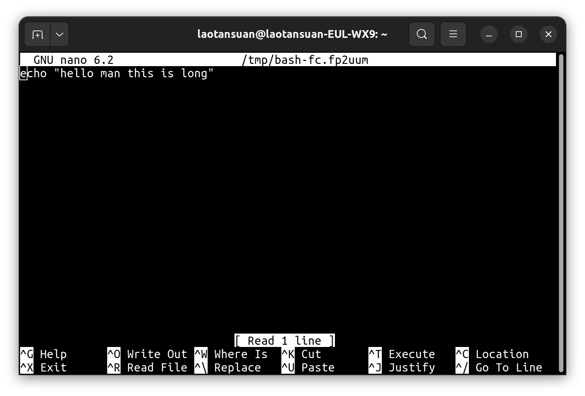

# Efficiency 2：在bash命令行使用Vim模式进行快速移动和编辑

## 整理人：林睿楠
## 整理时间：2026.1.24

### 问题描述

因为习惯了使用 Vim，每次编辑命令行都没有那么地舒服。虽然命令行本身也支持一些快捷键，但感觉不太够用。要是能在编辑命令行的时候使用 Vim 就好了。

首先，先再次复习一下 Bash 自带的 Emacs 模式的快捷键：

- **Ctrl+A**：移动到行首（Home）；
- **Ctrl+E**：移动到行尾（End）；
- **Alt+B**：向回跳一个单词（Back）；
- **Alt+F**：向前跳一个单词（Forward）；
- **Ctrl+U**：剪切（删除）光标之前的所有内容；
- **Ctrl+K**：剪切（删除）光标之后的所有内容；
- **Alt+.（点）**：直接调用上一个命令的最后一个参数（超级好用！）；
- **!!**：执行上一条命令（常用于忘记加`sudo`时：`sudo !!`）。

***注意***：当下面在 bash 中开启了 vi 模式之后，上面这些快捷键（除了`!!`不是快捷键以外）就用不了了，这是非常正常的，因为上面这些是 Emacs 模式的快捷键。开启 vi 模式相当于你放弃 Emacs 而拥抱 Vim。

### 在 bash 中开启 vi 模式

在 bash 中使用 Vim 的基本方法是：

```bash
set -o vi
```

可以把它写进`~/.bashrc`中。

开启了 vi 模式之后，默认情况下，它在**插入模式（Insert Mode）**，就是正常打字。当按下`Esc`键之后，就进入**命令模式（Command Mode）**。之后，你就把它当作只有一行的 Vim 文本用就行了，一些简单的 Vim 操作都是没问题的。

但是，它仍然不够完美。默认的 bash vi 模式是一个“精简版”，它并不支持“文本对象”（Text Objects）的操作。它只支持基础的**动作（Motion）**，而不支持像`ci"`这样的**文本对象**操作。这是因为，bash 使用的是 **Readline 库**来实现命令行编辑，而 Readline 的 vi 模拟程度大约只有原生 Vim 的 60%~70%。

### 使用`v`呼叫“全功能 Vim”

根据 Gemini 的指点，在命令模式下按下`v`，bash 就会把当前内容丢进一个临时的`.sh`文件，并用真正的 Vim 打开。在这里面，上面所有的问题都会解决。

但是，当我按下`v`后，出现的是这样的界面：



这是 Nano 编辑器的界面，而非 Vim。想要退出 Nano，只要像窗口底部说的那样`Ctrl+X`就行了。出现这样的原因，通常是因为 Linux 系统默认将 Nano 设为了标准编辑器。

所以，要告诉 bash 我想默认使用的编辑器是 Vim。于是，在`~/.bashrc`中添加这一行：

```bash
export EDITOR=vim
```

添加完毕后，就可以用全能的 Vim 编辑命令行了。

### 使用`jk`快速打开 Vim

我们会发现，先要按`Esc`，然后还要按`v`，这是很不方便的。正好我们在 Vim 中已经习惯了使用`jk`映射成`Esc`达到迅速离开 Insert Mode 的效果，我们也可以把这里的`Esc+v`两步使用`jk`来代替。

在`~/.bashrc`中加入以下内容：

```bash
# In bash's vi mode, use `jk` to exit Insert mode and enter real Vim editor. It is equal to `Esc` then `v`.
bind -m vi-insert '"jk": edit-and-execute-command'
bind 'set keyseq-timeout 300'
```

其中，`keyseq-timeout`是快捷键映射中的“超时机制”。当你按下`j`时，bash 不会立刻把`j`显示出来，而是会等待一小段时间（通常默认是 500 毫秒到 1 秒）。

- 如果在等待时间内按下了`k`，那就是映射的内容；
- 如果超时了再按下`k`，就是两个字符`j`和`k`；
- 如果按下了其他键，比如`a`，就立刻显示`ja`。