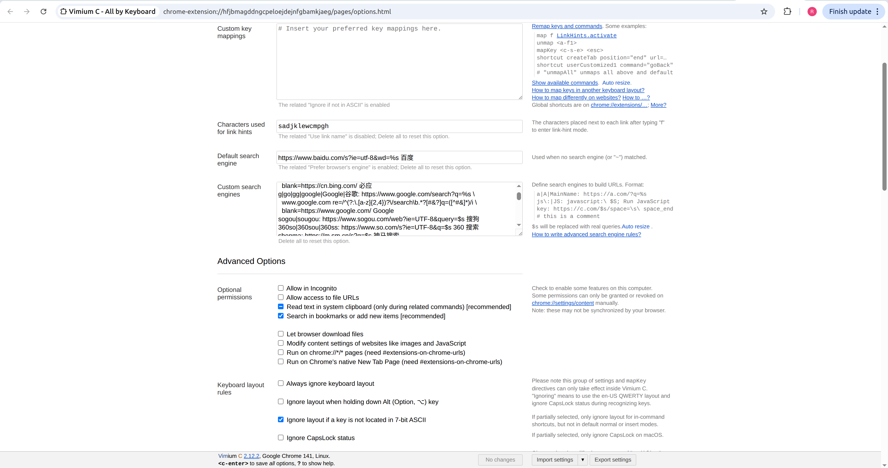

# Efficiency 4
# 在 Chrome 中抛弃 Vimium 插件改用 Vimium C 直接起飞

## 整理人：林睿楠
## 整理时间：2026年1月26日

### 问题描述

一开始，我在 [Missing Semester](https://missing.csail.mit.edu/2020/editors/) 的推荐下，在 Chrome 浏览器中安装了 Vimium 插件。这个插件能够把一些常规操作映射成键盘按键，让你像用 Vim 一样操作 Chrome。

但是，在使用 Vimium 的时候，遇到了两个主要的问题：

1. 焦点问题

    在使用 Google Gemini 的时候，使用 `Esc` 离开输入框后，没法直接按 `u` 和 `d` 对答案进行翻页，还是需要用鼠标点击一下回答的区域，强制让焦点回到主体部分，才可以正常翻页。

2. 选择性失灵

    对于有些网页，很多功能都不支持，尤其是在操作腾讯文档的时候，都没法使用 `J` 和 `K` 进行网页切换。在某些复杂的网页（比如 Gmail、知乎或者各种后台管理系统）里，Vimium 会突然“武功尽失”，按什么都没反应。

3. 搜索功能不方便

    原生 Vimium 的 `/` 搜索经常搜不到隐藏在浮层或者 iframe 里的内容。

### 基础改进方法

在 Google Gemini 的引导下发现了 Vimium C 这个升级版的插件。Vimium 就像是 Vim 世界的入门初恋，单纯美好；而 Vimium C 则是能陪你闯荡江湖、甚至能帮你档子弹的硬核战友。Vimium C 在很多反人类的细节上做了降维打击式的优化。

除了焦点管理的问题能够迎刃解决外，Vimium C 的搜索逻辑几乎是“挖掘机”级别的，只要页面上有，它就能定位到。Vimium C 不再选择性失灵，它针对这些复杂 DOM 结构做了深度适配，稳定性高出一大截。

除了解决一些棘手的现实问题意外，Vimium C 还引入了很多新的功能，等待你持久地去探索。

### 进阶：自定义搜索引擎

Vimium C 的**自定义搜索引擎（Custom Search Engines）**是提高信息检索效率的神器。它允许你通过简单的关键词（如 `g` 代表 Google，`zh` 代表知乎）在 Vomnibar 中直接跳转到目标网站的搜索结果页，甚至能支持搜索建议（Search Completion）（这个以后用熟了再来继续探索）。

自定义搜索引擎的配置是在 Vimium C 设置页面的“Search Engines”大框中：

在我启用 Vimium C 插件的时候，它就已经非常贴心地帮我配置好了一大堆搜索引擎的配置了。配置的基础格式是：`关键词: 查询URL [搜索引擎名称]`。其中，`%s`可以充当占位符。例如：`g: https://www.google.com/search?q=%s Google`。

使用方法是：首先按下 `o` 或 `O`（当前页打开和新页打开的区别），会弹出 Omnibox。接着，输入 `g`，空格，以及你想搜索的内容，按下回车即可。