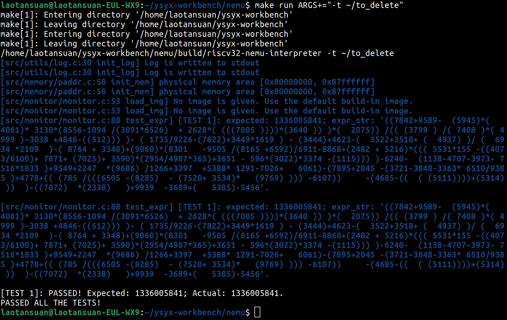
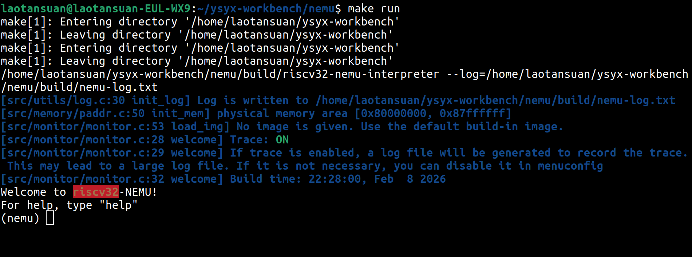
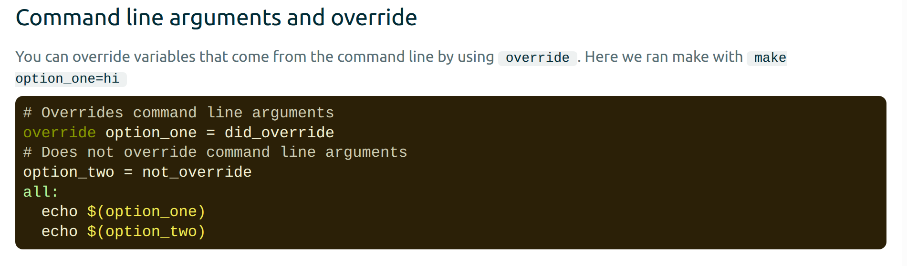
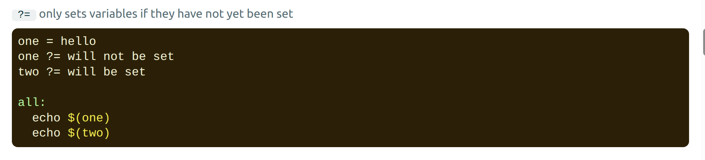

# Bug 4：如何在命令行向NEMU传递参数

## 整理人：林睿楠
## 整理时间：2026.2.9

### 问题描述

当我尝试使用NEMU自带的`Log`工具进行regex测试的输出时，我发现它会把相同内容输出两遍：



### 直接原因：输出到了stdout

下图是没有开启`-t`选项时的输出结果：



可以看出，这个输出还是很正常的，每条Log都只输出了一遍。再仔细比对一下细节可以发现，`make run`跑的命令是：

```bash
/home/laotansuan/ysyx-workbench/nemu/build/riscv32-nemu-interpreter --log=/home/laotansuan/ysyx-workbench/nemu/build/nemu-log.txt
```

而`make run ARGS+="-t ~/to_delete"`跑出来的命令是：

```bash
/home/laotansuan/ysyx-workbench/nemu/build/riscv32-nemu-interpreter -t ~/to_delete
```

可以发现，我们本意是在`ARGS`变量中添加一个参数选项`-t ~/to_delete`，但是却把原本自带的`--log=/home/laotansuan/ysyx-workbench/nemu/build/nemu-log.txt`给弄丢了。

Log的输出内容也印证了这一点：正常输出的内容是`[src/utils/log.c:30 init_log] Log is written to /home/laotansuan/ysyx-workbench/nemu/build/nemu-log.txt`，而我们的操作下输出的内容是`[src/utils/log.c:30 init_log] Log is written to stdout`。因为我们丢失了`--log`选项，所以输出到了`stdout`。

进一步阅读代码可以更深入地理解为什么会这样。`Log`的本质定义如下所示：

```c
#define Log(format, ...) \
    _Log(ANSI_FMT("[%s:%d %s] " format, ANSI_FG_BLUE) "\n", \
        __FILE__, __LINE__, __func__, ## __VA_ARGS__)

#define _Log(...) \
    do { \
        printf(__VA_ARGS__); \
        log_write(__VA_ARGS__); \
    } while (0)
```

它既要往`stdout`输出，又要往指定的log文件中输出。而`init_log`函数的定义如下：

```c
void init_log(const char *log_file) {
    log_fp = stdout;
    if (log_file != NULL) {
        FILE *fp = fopen(log_file, "w");
        Assert(fp, "Can not open '%s'", log_file);
        log_fp = fp;
    }
    Log("Log is written to %s", log_file ? log_file : "stdout");
}
```

当丢失了`--log`参数时，`init_log`默认的log文件就是`stdout`。所以，当`--log`没有指定时，就会把相同的内容往`stdout`中输出两遍。

### 为什么我们的命令让`--log`选项出不来

再来回顾我们使用的命令：

```bash
make run ARGS+="-t ~/to_delete"
```

这个命令为什么会覆盖掉原来写在Makefile里面的`ARGS`变量内容？我们来看Makefile是怎么写的：

```makefile
override ARGS ?= --log=$(BUILD_DIR)/nemu-log.txt
override ARGS += $(ARGS_DIFF)
```

#### 理解`override`

首先，我们要理解`override`是什么意思。[Makefile Tutorial](https://makefiletutorial.com/#command-line-arguments-and-override)中是这样介绍的：



`override`指令的核心作用是**保护变量不被命令行参数覆盖**。通常情况下，如果你在命令行中运行`make CC=gcc`，那么Makefile内部定义的`CC = clang`就会失效。但如果你使用了`override`，Makefile内部的设定就会拥有“最高优先级”。

##### 使用场景举例

###### 场景1：强制锁定变量

如果你不希望用户通过命令行修改某个变量，可以这样写：

```makefile
override DATA_PATH = /opt/app/data
```

即使运行`make DATA_PATH=/tmp`，程序依然会使用`/opt/app/data`。

###### 场景2：在命令行参数后追加（最常用）

这是最实用的功能。它允许你保留用户输入的参数，同时加上系统运行必不可少的参数。

```makefile
override CFLAGS += -Wall -I./include
```

如果运行`make CFLAGS=-O3`，则上面的指令会将`-Wall -I./include`追加到`-O3`后面。

##### 优先级对比

在没有`override`的情况下，变量优先级的顺序通常是：

1. 命令行参数（如`make VAR=value`）——最高；
2. Makefile内部定义；
3. 环境变量——最低。

使用`override`后，Makefile内部定义的优先级将反超命令行参数。

#### 理解为什么有`?=`了还加`override`

[Makefile Tutorial](https://makefiletutorial.com/#flavors-and-modification)中是这样描述的：



就是说，如果这个变量尚未定义，就用这个进行默认定义。

那么，既然逻辑上是这样的，似乎加`override`没有必要？因为如果命令行重新定义了这个变量，那么无论是否加`override`，这个`?=`都不会被赋值了。

事实上，在运行结果上确实如此。但是，建议还是加上`override`。加了`override`相当于给这个变量打了一个“此变量受Makefile法律保护”的标签。如果写成：

```makefile
ARGS ?= --log=$(BUILD_DIR)/nemu-log.txt
override ARGS += $(ARGS_DIFF)
```

首先，第二行虽然能强行追加，但会显得很突兀。其次，这种写法虽然合法，但存在逻辑断层。在维护大型Makefile（如NEMU）时，如果其他开发者看到第一行没有`override`，可能会误以为这是一个可以被后续普通赋值修改的普通变量，从而写出`ARGS += --flag`这种在命令行参数存在时会失效的代码。

其实，在一种非常罕见的情况下，加不加`override`是有区别的：环境变量。如果你在Shell里`export ARGS=env_value`，然后直接运行`make`（不带命令行参数），`ARGS ?=`会发现`ARGS`已经有值来自环境变量了，于是会跳过赋值。加了`override`之后，则会无视环境变量。

所以，这就是为什么在优秀的开源项目（如Linux Kernel，QEMU）中，只要涉及到需要保护的变量，你会看到一排整齐的`override`。这就好比在写C++时，如果你决定一个成员变量是`private`的，那么所有操作它的函数都要遵循这个逻辑，而不是混用。

#### 完整过程复盘

1. 命令行解析让`ARGS`变量加上了`-t`选项；
2. 因为`ARGS`已经非空了，`?=`不再起作用，即使加了`override`，导致`--log`选项丢失；
3. 后续`$(ARGS_DIFF)`因为加了`override`，仍然能够正常添加。

### 修改方案

使用如下命令：

```bash
make run ARGS='--log=$(NEMU_HOME)/build/nemu-log.txt -t $(HOME)/to_delete'
```

这里要注意，不能再使用`$(BUILD_DIR)`了，因为在命令行解析的时候，这个变量还没被`make`读取Makefile解析。同时注意单引号，如果使用双引号的话，`$()`会被Shell当成命令展开，导致报错。