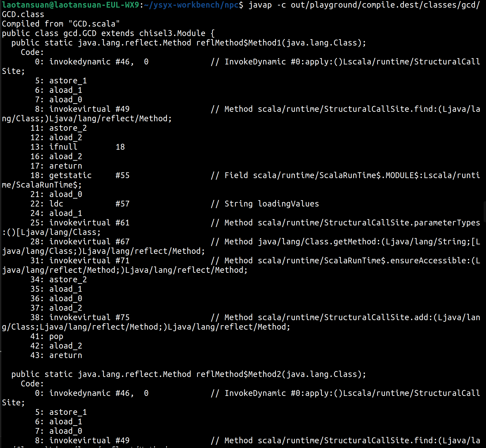

# 深入理解npc-chisel框架代码

## 整理人：林睿楠

这里的npc-chisel框架代码，对应我自己ysyx-workbench中的commit号`6c65e91`。项目的根目录在下面语境中都是`~/ysyx-workbench/npc/`。

### `make test`做了什么

首先，看`Makefile`中的规则：

```makefile
PRJ = playground

test:
	mill -i $(PRJ).test
```

首先，`-i`选项是什么意思。`mill --help`告诉我们：

```
-i --interactive     Run Mill in interactive mode, suitable for opening REPLs and taking user input. This implies --no-server. Must be the first argument.
```

就是运行在交互模式。

- **禁用服务端模式（Non-Daemon）**：默认情况下，Mill会启动一个后台守护进程（Server）来加速后续编译。使用`-i`会让Mill在当前进程中直接运行，任务结束后进程立即退出。
- **启用标准输入（Standard Input）**：这是它最重要的功能。在默认模式下，Mill的后台进程无法直接接收键盘输入。如果测试代码（例如`test`）需要用户在控制台输入任何内容，就必须加上`-i`。

而在Chisel设计验证环境中，这一点很重要，因为Mill默认会并行运行测试。如果在两个终端里同时运行不带`-i`的命令，会发现它们可能共用同一个Mill Server，这时会发生各种资源的冲突，比如锁定端口（如果测试涉及网络协议仿真，可能会占用固定端口）、写死路径（很多EDA工具默认把日志写在固定的`top.log`里）、大内存占用（多个仿真同时跑，容易把内存挤爆）。总结一下，就是我们要追求`-i`带来的“确定性”：

- **确定输入**：确保你的键盘输入（stdin）能直接传给仿真器；
- **确定路径**：让Mill作为一个简单的、可预测的程序运行，而不是一个复杂的“客户端-服务器架构；
- **确定环境**：在Makefile这种可能存在并行调度的环境下，保护环境不被弄乱。

mill需要配合一个叫`build.mill`的配置文件。它使用Scala语言编写，告诉mill程序你的项目有哪些模块、依赖哪些库、使用哪个版本的编译器等。下面是`build.mill`文件中的代码：

```scala
package build

// import Mill dependency
import mill._
import mill.define.Sources
import mill.modules.Util
import mill.scalalib.scalafmt.ScalafmtModule
import mill.scalalib.TestModule.ScalaTest
import mill.scalalib._
// support BSP
import mill.bsp._

object playground extends ScalaModule with ScalafmtModule { m =>
	override def scalaVersion = "2.13.15"

	override def scalacOptions = Seq(
		"-language:reflectiveCalls",
		"-deprecation",
		"-feature",
		"-Xcheckinit"
	)

	override def ivyDeps             = Agg(ivy"org.chipsalliance::chisel:6.6.0")
	override def scalacPluginIvyDeps = Agg(ivy"org.chipsalliance:::chisel-plugin:6.6.0")

	object test extends ScalaTests with TestModule.ScalaTest with ScalafmtModule {
		override def ivyDeps = m.ivyDeps() ++ Agg(
		ivy"org.scalatest::scalatest::3.2.19",
		// for formal flow in future
		ivy"edu.berkeley.cs::chiseltest:6.0.0"
		)
	}

	def repositoriesTask = Task.Anon {
		Seq(
		coursier.MavenRepository("https://repo.scala-sbt.org/scalasbt/maven-releases"),
		coursier.MavenRepository("https://oss.sonatype.org/content/repositories/releases"),
		coursier.MavenRepository("https://oss.sonatype.org/content/repositories/snapshots")
		) ++ super.repositoriesTask()
	}
}
```

`build.mill`定义了一个名为`playground`的模块，以及一个名为`test`的子模块。在Mill的世界里，`playground.test`这种写法被称为任务选择器（Task Selector）。

因为`playground`继承了`ScalaModule`，Mill会自动为它分配标准的任务（Task），例如`compile`、`run`、`jar`等。这些任务通常分为只读配置项、操作任务和结果输出，遵循DAG（有向无环图）结构，像Make那样根据缓存与文件改动来构建项目。`test`也是一样的道理，只是它继承的是`ScalaTests`。

以下是键入`mill -i playground.test`之后Mill详细的执行步骤：

#### 路径自动发现（Path Resolution）

由于`playground`模块继承了`ScalaModule`，Mill会按照默认约定查找代码。

##### 源码路径：Mill发现`src`目录下有`GCD.scala`等文件，会自动将`src/`映射为`playground.sources`。

为什么Mill会自己发现`src`下的文件，并将它们映射到`playground.sources`？这是由`playground`继承的`ScalaModule`继承的`JavaModule`定义在它`sources`中的任务。在`mill.scalalib.JavaModule`的源码中，`sources`任务有一个默认实现，大致逻辑如下（伪代码）：

```scala
def sources = T.sources {
	millSourcePath / "src"
}
```

假设你并不想把源码放在`playground/src`这个文件夹中，而是想放在`playground/code`，只需在`build.mill`中重写这个任务：

```scala
object playground extends ScalaModule {
	// 修改默认的源码映射路径
	override def sources = T.sources {
	millSourcePath / "code"
	}
}
```

##### 测试路径：Mill发现`test/src`目录，会自动将其映射为`playground.test.sources`。

为什么`test`是个`object`，但也有任务？首先，`ScalaTests`是Mill定义的一个标准“任务包”；其次，复杂的继承链将带来许多继承而来的任务。

如果想要查看`test`模块拥有多少个任务，可以运行：

```bash
mill resolve playground.test._
```

#### 构建任务流的详细拆解

当敲下回车，Mill内部会发生以下连锁反应：

##### 资源准备（Resource Mapping）

Mill检查是否存在`resources`文件夹。虽然目录里没有显示，但Mill仍会生成一个空的`playground.resources`任务节点。

首先，什么是`resources`？`sources`是什么很明确，就是源码，而`resources`代表了诸如`.conf`、`.json`、`.txt`、图像、硬件约束文件等一系列资源文件。

按照约定，Mill会查找`millSourcePath / "resources"`文件夹，并将找到的所有文件拷贝到`out/playground/resources.dest/`中。在运行JVM时，它会将这个`.dest`目录加入到`Classpath`中。

为什么硬件开发（Chisel）可能会需要它？

- **内存初始化**：如果在Chisel中使用`loadMemoryFromFile`，通常会将`.hex`或`.mem`文件放在`resources`文件下，这样仿真器就能在运行时找到它们。
- **配置文件**：存放测试向量（Test Vectors）或复杂的SoC配置文件。
- **版本信息**：存放一个包含Git Commit ID的文本文件，让程序运行时能打印出当前的硬件版本。

##### 主模块编译（Compiling Main）

1. **输入**：`src/*.scala`(DecoupledGCD, Elaborate, GCD)。

2. **插件注入**：由于在`build.mill`中重写了`scalacPluginIvyDeps`，Mill会在启动编译器时，将Chisel编译器插件插入到编译流程中。

	什么是`scalac`？`scalac`是Scala编程语言的官方编译器。它的工作是将你写的`.scala`源文件转换成可以在JVM（Java虚拟机）上运行的`.class`文件。当你运行`mill playground.compile`时，Mill实际上是在后台组织好参数，然后调用`scalac`。

	普通的`scalac`只懂标准的Scala语法，它并不懂硬件电路的特殊约束。Chisel编译器插件就像是给`scalac`这台机床换了一把“特种刀具”：

	- **语法转换**：Chisel允许你用Scala描述硬件（比如`RegNext`），插件会介入编译过程，确保这些特殊的硬件对象被正确处理。
	- **错误检查**：普通的Scala编译器不会觉得`a := b`有什么问题，但Chisel插件会检查`a`和`b`的位宽是否匹配，或者你是否在非法位置连接了信号。
	- **代码增强**：它会自动为你的硬件模块生成一些“元数据”，方便后续转换成Verilog。

	而我们已经在`build.mill`中指定了添加Chisel编译器插件的要求：

	```scala
	override def scalacPluginIvyDeps = Agg(ivy"org.chipsalliance:::chisel-plugin:6.6.0)
	```

	什么是`scalaPluginIvyDeps`？这是一个专门用于管理Scala编译器插件（Compiler Plugins）的配置项。它定义的依赖包不会被包含在你最终运行的程序里，而是在编译阶段被加载到`scalac`（编译器）内部。
	
	`Ivy`是“Apache Ivy”的缩写，它是Java世界中一个非常经典且强大的依赖管理引擎。在Mill的语境下，当你写下`ivy"org.chipsalliance::chisel:6.6.0"`时，你实际上是在使用一个定为符，告诉Mill去哪里寻找、下载并管理你需要的库。Mill使用了Scala的字符串插值（String Interpolation）来简化Ivy的写法。以`ivy"org.chipsalliance :: chisel : 6.6.0"`为例：

	- **`org.chipsalliance`（Organization）**：组织名，类似公司的域名。
	- **`chisel`（Artifact）**：项目名，具体库的名称。
	- **`6.6.0`（Revision/Version）**：版本号。

	冒号的数量是Scala构建工具（如Mill和sbt）特有的魔法：

	- **一个冒号`:`**：代表这是一个纯Java库（不区分Scala版本）。
	- **两个冒号`::`**：代表这是一个Scala库。Mill会自动在项目名后面加上你的Scala版本号。
	- **三个冒号`:::`**：常用于编译器插件。它要求插件版本必须与编译器（scalac）的全版本号严格匹配。

3. **宏处理与电路检查**：`scalac`配合Chisel插件，会对`GCD`、`DecoupledGcd`等硬件代码进行静态检查，处理Chisel特有的`@public`或类型推导。

4. **输出**：在`out/playground/compile.dest/classes`目录下生成字节码。

	字节码是什么？它是直接运行在JVM（Java虚拟机）上的程序。在编译期，`scalac`把你的`DecoupledGcd.scala`翻译成字节码（`.class`）；在运行期，JVM拿到字节码，通过解释器或者JIT（即时编译器）把它翻译成当前CPU能听懂的机器码。它就是“跨平台的普通话”。

	可以通过如下命令查看字节码大概里面包含什么内容：

	```bash
	javap -c out/playground/compile.dest/classes/gcd/DecoupledGcd.class
	```

	下面的截屏展示了部分内容：

	

	看起来长得就像是汇编一样。

##### 测试模块编译（Compiling Test）

1. **依赖引入**：`playground.test`任务会要求`playground.compile`必须先完成。

2. **Classpath拼接**：Mill将`playground`的输出结果、Chisel核心库、以及你在`test`对象里定义的`scalatest`和`chiseltest`全部加入到编译路径中。

3. **输入**：`test/src/GCDSpec.scala`。

4. **输出**：生成测试类的字节码，放在`out/playground/test/compile.dest/classes/gcd/GCDSpec.class`。

##### 测试执行（Test Execution）

1. **JVM启动**：Mill启动一个Java进程运行`org.scalatest.tools.Runner`。

	什么是`org.scalatest.tools`？它是ScalaTest框架提供的官方**命令行入口点（Entry Point）**。

	如果不使用Mill，手动在终端启动测试，就需要写一段又臭又长的命令：`java -cp "所有的Jar包" org.scalatest.tools.Runner -s gcd.GCDSpec -o`。

	Runner的具体职责包括：

	- **配置解析**：处理命令行参数（比如`-o`表示输出到标准输出，`-u`生成单元测试报告）。
	- **套件发现**：在Classpath中寻找所有继承了`Suite`的类（比如这里的`GCDSpec`）。
	- **报告管理**：负责在控制台打印出那一行行绿色的`[PASSED]`或红色的`[FAILED]`。
	- **生命周期管理**：负责调用你测试代码中的`beforeAll`、`afterAll`以及每一个`it should "..."`测试块。

	Mill是怎么知道要运行`org.scalatest.tools.Runner`的？在Mill的源码中，`TestModule.ScalaTest`这个特质重写了一个名为`testFramework`的方法：

	```scala
	// Mill源码大致逻辑
	override def testFramework = "org.scalatest.tools.Framework"
	```

	当执行`test`任务时，Mill会调用测试库。ScalaTest的标准`Framework`会告诉Mill：“如果你想在单独的进程里跑我，请启动`org.scalatest.tools.Runner`。Mill检查`ivyDeps`，发现里面确实有`scalatest`的Jar包。它从Jar包的元数据中确认了这个类的存在，然后拼接好启动命令。

2. **扫描**：它加载`GCDSpec.scala`编译后的类，识别出它是一个ScalaTest套件。

3. **仿真运行**：

	- `GCDSpec`实例化`DecoupledGcd`硬件模块。

		之前我们说过，在编译阶段，`GCDSpec`、`DecoupledGcd`都已经被翻译成了Java字节码，所以它们是字节码之间的调用关系。当在测试中写下`test(new DecoupledGcd())`的时候，JVM加载的`GCDSpec`字节码执行到这一行时，它会去Classpath（类路径）中寻找名为`DecoupledGcd`的字节码文件，并将其加载进内存。

		硬件逻辑是如何在字节码中表达的？这是一个很有趣的点。`DecoupledGcd`是硬件描述，但它的字节码其实是“构建电路的指令”。`DecoupledGcd`中的指令并不是在做算数运算，而是在调用Chisel库的方法，在内存中勾勒出一张**数据流图**。例如，源码里的`io.out := a + b`，在字节码层面是调用了Chisel的连接方法（`Op`，`Connection`等对象）。当`GCDSpec`调用`test(...)`时，Chisel会把内存中这张由`DecoupledGcd`字节码生成的“图”序列化成**FIRRTL**（一种中间表示），然后交给仿真引擎（如Treadle是默认仿真引擎）。

	- 如果使用了`chiseltest`，它会调用后端的仿真引擎（如Firrtl Terp或Verilator）。

		`GCDSpec`到底在处理什么？当你运行测试时，`GCDSpec`实际上在与两个东西打交道：

		1. **`DecoupledGcd`对象的接口**：通过字节码暴露出来的`io`端口（`in`，`out`，`ready`，`valid`）。
		2. **仿真句柄（Handle）**：`GCDSpec`并没有直接“运行”硬件逻辑，而是通过字节码指令给仿真引擎下达指令：“请把这个输入填到这个寄存器里”、“请让时钟跳动一个周期”、“请读取输出端口的值”。

		所以，

		- `DecoupledGcd`字节码是一个能够“画出”电路图的Scala程序；
		- `GCDSpec`字节码是一个能够“查看”这张电路图并指挥仿真器去模拟它的测试程序。

		这种“字节码处理字节码”的模式，正是Chisel能够利用Scala强大的类型系统和面向对象特性来构建复杂硬件的原因。

	- 交互式输出：由于使用了`-i`，测试过程中的`println`或错误堆栈会实时、不间断地刷新在你的终端上。

#### 结果产物映射

运行结束后，可以查看`out`目录：

| 文件路径 | 内容说明 |
| --- | --- |
| `out/playground/compile.json` | 编译任务的元数据（耗时、哈希值） |
| `out/playground/test/compile.dest/classes/` | 测试代码编译后的`.class`文件 |

#### `build.mill`中的其他要点

##### 解释每一处依赖

首先搞明白`ivyDeps`和`scalacPluginIvyDeps`的区别：

| 特性 | `ivyDeps`（普通依赖） | `scalacPluginIvyDeps`（编译器插件） |
| --- | --- | --- |
| **它是谁的依赖？** | **代码逻辑**的依赖 | **编译器scalac**本身的插件 |
| **什么时候起作用？** | **编译时**（找符号）和**运行时**（跑代码） | **仅在编译过程中**（改写代码或检查语法） |
| **是否被打入包中？** | 是的，运行程序必须带着它们（Classpath） | 不，编译完就不需要它们了 |
| **在Chisel中的角色** | 提供`Module`，`UInt`，`Bundle`等类定义 | 负责生成信号名、检查连线、处理特殊的硬件语法 |

`ivyDeps`：**让代码能“编译通过”**。当你写`class GCD extends Module`时，如果没有`ivyDeps`里的Chisel库，编译器就会报错：`not found: type Module`。它需要这些依赖来解析你代码中的各种类和类型。

`scalacPluginIvyDeps`：**让代码“符合硬件逻辑”**。Chisel编译器插件在`scalac`工作时会做以下几件事：

1. **自动命名**：它会把你在Scala里的变量名（如`val myReg = Reg(...)`）传递给底层的硬件信号。没有插件，生成的Verilog信号名就会变成无意义的随机字符。
2. **安全性检查**：它会检查你是否在`Module`之外定义了硬件原语。
3. **语法增强**：处理一些Scala本身不支持但在硬件描述中必要的底层转换。

以下是针对`build.mill`文件中每一处配置的详细说明：

1. **`playground`模块中的`ivyDeps`**

	```scala
	override def ivyDeps = Agg(ivy"org.chipsalliance::chisel:6.6.0")
	```

	这是项目的核心库。当编写`class GCD extends Module`或使用`UInt`、`Bundle`等类型时，编译器`scalac`需要这些字节码来定义什么是`Module`，什么是硬件类型。当运行`Elaborate.scala`来生成Verilog时，JVM会加载这个Jar包，执行其中的代码来构建电路图。

2. **`playground`模块中的`scalacPluginIvyDeps`**

	```scala
	override def scalacPluginIvyDeps = Agg(ivy"org.chipsalliance:::chisel-plugin:6.6.0")
	```

	- **作用对象**：`scalac`编译器本身。
	- **具体意义**：这是一个“编译器插件”。由于Scala原生语法并不完全支持硬件描述的所有细节（例如：自动捕获变量名作为信号名），这个插件会挂载到`scalac`的编译流程中。
	- **关键点**：注意这里使用了**三个冒号`:::`**。这意味着该插件的版本必须与你的`scalaVersion`（2.13.15）严格匹配，因为它直接操作编译器的内部数据结构（抽象语法树AST）。
	- **后果**：如果没有它，你的代码虽然能编译成功，但生成的硬件信号可能失去名字，或者无法通过Chisel的一些安全检查。

3. **`test`模块中的`ivyDeps`**

	```scala
	object test extends ScalaTests with TestModule.ScalaTest with ScalafmtModule {
		override def ivyDeps = m.ivyDeps() ++ Agg(
			ivy"org.scalatest::scalatest::3.2.19",
			// for formal flow in future
			ivy"edu.berkeley.cs::chiseltest:6.0.0"
		)
	}
	```

	- **作用对象**：测试代码（`test/src/*.scala`）。
	- **构成解析**：
		- **`m.ivyDeps()`**：这是一个函数调用，它把父模块`playground`里的`chisel:6.6.0`直接拿了过来。
		- **`scalatest`**：提供了测试框架（如`AnyFlatSpec`），负责断言、报告打印和测试流程控制。
		- **`chiseltest`**：这是专门为Chisel设计的仿真库。它负责连接你的代码和仿真后端（如Treadle或Verilator），并提供`poke`（给信号赋值）和`expect`（检查信号值）等API。
	- **运行时影响**：当你执行`mill playground.test`时，JVM必须同时加载这三个库的字节码，才能跑通`GCDSpec.scala`。

4. **`repositoriesTask`中的仓库配置**

	```scala
	def repositoriesTask = Task.Anon {
		Seq(
			coursier.MavenRepository("https://repo.scala-sbt.org/scalasbt/maven-releases"),
			coursier.MavenRepository("https://oss.sonatype.org/content/repositories/releases"),
			coursier.MavenRepository("https://oss.sonatype.org/content/repositories/snapshots)
		) ++ super.repositoriesTask()
	}
	```

	- **关联性**：虽然这些代码里没有写`ivy`字样，但是它是上面所有`ivyDeps`的“后勤保障”。

	- **作用**：当你声明了上面的依赖坐标后，Mill会调用Cousier（底层引擎）去这些制定的URL寻找并下载对应的`.jar`文件。如果删掉这些，Mill可能找不到`chisel:6.6.0`这种特定于芯片设计联盟的库。

		这一段代码涉及到了Mill的底层任务系统和Java生态的包管理机制。我们可以拆解开来看：

		1. **什么是Coursier？**

			Coursier是Scala生态中几乎所有构建工具（Mill, sbt等）都在使用的**底层下载引擎**。

			- **它的角色**：它是那个真正去互联网上“跑腿”取快递的角色。
			- **为什么用它**：它非常快，支持并行下载，并且能非常聪明地处理版本冲突。
			- **在代码中的位置**：`coursier.MavenRepository(...)`告诉Coursier：“除了默认的地方，你还可以去这几个指定的网址找包。”

		2. **什么是Maven？**

			Maven既是一个构建工具，也是一种**仓库标准**。

			- **仓库标准**：它定义了文件在服务器上是怎么存放的（比如`组名/项目名/版本号/包名.jar`）。
			- **代码含义**：`MavenRepository("URL")`声明了一个符合Maven标准的远程仓库地址。
				- `sonatype`仓库通常存放很多开源项目的早期版本（Snapshots）或正是发布版（Releases）。
				- `scala-sbt`仓库存放很多与Scala构建工具相关的插件。
		
		3. **++ super.repositoriesTask()是什么意思？**

			这行代码是在做**列表合并**。

			- **super.repositoriesTask()**：调用父类（即`ScalaModule`或`JavaModule`）默认定义的仓库列表。Mill默认已经包含了**Maven Central**（全球最大的Java包仓库）。
			- **`++`**：Scala中的集合合并操作符。
			- **整体意思**：我定义了3个自定义的仓库，并把它们**加到**Mill默认的仓库列表前面。这样Mill找包时会先看这3个地方，找不到再去官方仓库找。

		4. **`Task.Anon`是什么意思？**

			`Anon`是**Anonymous（匿名）**的缩写。它是Mill任务系统中的一个核心概念。

			在Mill中，任务分为两类：

			1. **具名任务（Named Task）**：例如`def compile = T { ... }`。这些任务可以通过命令行调用（如`mill playground.compile`），且结果会被持久化缓存到`out/`目录。

			2. **匿名任务（Anonymous Task）**：即`Task.Anon { ... }`。

				- **不可直接调用**：你不能在终端输入`mill playground.repositoriesTask`，因为它没有名字。
				- **作为依赖使用**：它通常被其他任务（如`compile`或`ivyDeps`在内部引用。
				- **灵活性**：它不需要遵循严格的缓存路径规则，更像是一个“内部计算逻辑”，专门为其他具名任务提供数据。
			
		总结：这段代码在做什么？它扮演的是“后勤补给站”的角色：

		“定义一个**内部使用的任务**（Task.Anon），它会产生一个**仓库地址列表**。这个列表包含了3个特定的Maven仓库，再加上**Mill默认的官方仓库**。当Coursier去下载`chisel`或`scalatest`时，请按照这个列表顺序去这些网站上搜寻。”

		由于Chisel相关的库又是更新非常快，某些预览版只存在于`snapshots`仓库中。如果没有这段代码，Mill可能会因为找不到包而报错。

##### 传递给`scalac`的选项

```scala
override def scalacOptions = Seq(
	"-language:reflectiveCalls",
	"-deprecation",
	"-feature",
	"-Xcheckinit"
)
```

这些选项是传递给Scala编译器`scalac`的命令行参数，用于控制编译器的行为、启用特定语法支持或开启额外的代码质量检查。在Chisel项目中，这些选项通常是为了平衡**硬件描述的灵活性**与**代码的健壮性**。

1. **`-language:reflectiveCalls`**

	- **作用**：启用“反射调用”这一高级语言特性。
	- **为什么在Chisel中需要它？**Chisel经常使用一种称为“结构类型（Structural Types）”的Scala特性。例如，当你访问一个Bundle的IO端口时，Scala编译器在底层有时会使用反射来查找这些字段。
	- **如果不加会怎样？**编译器会抛出警告，提示你“feature reflectiveCalls should be enabled”。在Chisel/Scala 2.13环境下，为了保持代码简洁且能访问动态生成的硬件端口，通常需要开启它。

2. **`"-deprecation"`**

	- **作用**：当你的代码使用了**已过时（Deprecated）**的API时，编译器会给出详细的警告。
	- **为什么重要？**Chisel迭代非常快。例如，旧版本可能使用`val io = IO(new Bundle{...})`，而新版本推荐不同的写法。开启此项可以让你及时发现哪些代码在未来版本中可能会被删除，从而保持代码的现代化。

3. **`"-feature"`**

	- **作用**：告知编译器，如果代码使用了Scala的某些“高级特性”（如隐式转换、类型投影等），请给出详细的警告或说明。
	- **为什么重要？**Scala有很多强大的黑魔法。开启此项后，如果你在编写硬件模块时无意中触发了某种复杂的Scala语言特性，编译器会明确提醒你，防止你写出自己都看不懂的“奇迹淫巧”，提高代码的可维护性。

4. **`"-Xcheckinit"`**

	- **作用**：**这是硬件开发中最有用的选项之一**。它会在运行时（JVM层面）注入检查逻辑，确保你在字段初始化完成**之前**没有访问它。

	- **为什么在Chisel中极其重要？** 在Chisel中，硬件模块的初始化顺序非常微妙。
		
		- **典型错误**：你在父类里访问了一个子类还没定义的寄存器。
		- **现象**：如果没有这个选项，你会得到一个非常难调试的`null`指针异常或者是电路逻辑莫名其妙的错误。
		- **结果**：开启后，如果发生初始化顺序冲突，JVM会立即抛出明确的异常，直接指出哪行代码在“抢跑”。

	**典型Bug场景：父类“抢跑”访问子类变量**：假设你设计了一个基础模块`BaseModule`，希望在其中打印出模块的位宽：

	```scala
	import chisel3._

	// 父类：试图在初始化时读取width
	class BaseModule extends Module {
		val width: Int = 0	// 给个默认值
		println(s"Initializing module with width: $width")

		val io = IO(new Bundle {
			val in = Input(UInt(width.W))
			val out = Output(UInt(width.W))
		})
	}

	// 子类：重写了位宽
	class MyGCD extends BaseModule {
		override val width: Int = 16	// 这里的赋值其实比父类晚
	}
	```

	如果没有`-Xcheckinit`，你会遇到一个极其困惑的现象：你明明在`MyGCD`里写了`width = 16`，但运行仿真或生成Verilog时，你会发现`io.in`的位宽竟然是0。

	这个问题直指Scala语言底层的一个核心机制：**对象初始化顺序（Initialization Order）**。在Scala（以及Java）中，构造函数的执行是**自上而下**（从父类到子类）的，而字段的赋值也是在这个过程中发生的。我们一步步拆解`new MyGCD`时发生了什么：

	1. **分配内存**

		JVM为`MyGCD`对象分配内存。此时，所有的实例变量（`width`，`io`等）都会被赋予该类型的**默认初始值**：

		- `Int`类型的`width`被设为`0`。
		- 引用类型（如`io`）被设为`null`。
	
	2. **进入父类`BaseModule`的构造函数**

		Scala开始执行`BaseModule`的构造逻辑：

		1. 执行`val width: Int = 0`。
		2. 执行`println(...)`。此时它读取`width`。由于子类的赋值还没开始，它读到的是当前内存中的值`0`。
		3. 执行`val io = IO(...)`。它调用`width.W`。因为`width`还是`0`，所以它创建了一个**0位宽**的`UInt`端口。
	
	3. **进入子类`MyGCD`的构造函数**

		父类逻辑运行完后，才轮到子类：

		1. 执行`override val width: Int = 16`。
		2. **关键点**：此时内存中的`width`确实变成了`16`。但尴尬的是，父类的`io`端口已经在刚才用`0`创建完了！
	
	4. **结果**
		
		虽然你最后得到了一个`width`为`16`的对象，但该对象内部的`io`端口（在父类阶段就定型了）依然是**0位宽**。
	
	**为什么`-Xcheckinit`能抓到它？** 当你开启了`-Xcheckinit`，编译器会在生成的字节码中插入“状态位”。在父类`BaseModule`执行到`println`访问`width`时，检查器会看：**“子类的`width`初始化了吗？”** 它发现这个字段是被`override`的，而子类的赋值动作还没发生，检查器会认为这是一个**非法访问**，直接抛出`UninitializedFieldError`并终止程序，防止你拿着那个错误的`0`位宽去跑仿真。

	**根本原因总结**：在Scala中，`override val`在父类构造期间是不可见的（或者说还没准备好）。

	修正方案：在Chisel开发中，最稳妥、最常用的解决办法是使用**类参数**而不是`val`覆盖：

	```scala
	// 正确做法：将参数直接传递给构造函数
	class BaseModule(val width: Int) extends Module {
		val io = IO(new Bundle {
			val in = Input(UInt(width.W))
			val out = Output(UInt(width.W))
		})
	}

	// 子类直接传值给父类构造函数
	class MyGCD extends BaseModule(16)
	```

	为什么这样就行了？因为类参数（Constructor Parameters）在任何构造逻辑运行前就已经被赋值并准备好了。当父类开始运行`val io = ...`时，`width`已经是`16`了。

如何查看这些选项是否有效？如果想确认Mill确实把这些参数传给了编译器，可以运行：

```bash
mill show playground.scalacOptions
```

---

### `make verilog`做了什么

重点看`mill -i playground.runMain Elaborate --target-dir ./build`是干什么。这条命令和对应的代码是Chisel开发流程中的**核心环节：电路转化（Elaboration）**。它的任务是：运行你的Scala代码，把“硬件描述”翻译成真正的“电路文件”（SystemVerilog）。

`Elaborate`对象的代码如下：

```scala
object Elaborate extends App {
	val firtoolOptions = Array(
		"--lowering-options=" + List(
			// make yosys happy
			// see https://github.com/llvm/circt/blob/main/docs/VerilogGeneration.md
			"disallowLocalVariables",
			"disallowPackedArrays",
			"locationInfoStyle=wrapInAtSquareBracket"
		).reduce(_ + "," + _)
	)
	circt.stage.ChiselStage.emitSystemVerilogFile(new gcd.GCD(), args, firtoolOptions)
}
```

#### `runMain`是什么

##### `Elaborate`的`main`入口

我们要先了解什么是`main`入口。在JVM（Java虚拟机）看来，它并不认识什么是“测试”，也不认识什么是“硬件生成器”。它只认识一种东西：

```java
public static void main(String[] args) { ... }
```

我们之前分析的`playground.test`有`main`入口吗？有的。我们之前分析过，Mill会启动`org.scalatest.tools.Runner`，这实际上指的就是运行`org.scalatest.tools.Runner`里的`main`方法。

那么，我们这边`Elaborate`的`main`入口在哪里呢？`Elaborate`继承的是`App`，而`App`这个**特质（Trait）**的作用就是自动帮你生成一个`main`方法。在Scala的世界里，`App`是一个极具“极简主义”色彩的设计。它的核心设计目的是**将一个普通的Scala对象（Object）瞬间转变成一个可以独立运行的程序**，而无需编写冗长的`main`方法模板。

以下是关于`App`的设计目的、实现机制及使用细节的深度解析：

1. **设计目的：消除“样板代码”（Boilerplate）**

	在Java或标准的Scala中，一个可执行程序的入口必须严格遵守特定的格式：

	```scala
	// 标准写法：繁琐且必须手动处理参数数组
	object Main {
		def main(args: Array[String]): Unit = {
			// 你的逻辑
		}
	}
	```

	**`App`的设计初衷**：让开发者只需关注“我要跑什么逻辑”，而不是“入口函数怎么写”。通过`extends App`，你直接在对象的大括号里面写的任何代码，都会被自动视作程序的主逻辑。

2. **实现机制：延迟初始化（DelayedInit）**

	这是一个非常精妙的编译器技巧。当你写下`object Elaborate extends App`时，底层发生了以下变化：

	- **自动注入`main`方法**：编译器会为该对象自动生成一个标准的`main`方法。
	- **代码搬家**：在Scala 2.13之前，`App`利用了一个叫`DelayedInit`的特质。编译器会将你在对象构造体中写的代码包装起来，挪到一个初始化方法中。
	- **命令行参数**：`App`内部维护了一个名为`args`的成员变量。当`main`方法被调用时，传入的字符串数组会被赋值给这个`args`。

3. **核心用法细节**

	1. **访问命令行参数**

		由于`App`定义了`args`变量，你可以直接在代码中使用它，无需声明，例如：

		```scala
		object Elaborate extends App {
			if (args.length > 0) {
				println(s"The first argument is: ${args(0)})
			}
		}
		```

		在我们的命令`mill playground.runMain Elaborate --target-dir ./build`中，`args`数组就会包含`"--target-dir"`和`"./build"`。

	2. **静态初始化与运行**

		所有写在对象体内的语句，其实都是该对象的**构造代码**。这意味着当你运行这个程序时，JVM会加载这个类，执行构造过程，从而触发Chisel生成逻辑。

##### `test`和`Elaborate`的区别

`test`被设计成了`build.mill`中的一个任务，而`Elaborate`被设计成了源代码中的一个对象。

1. **为什么`test`被实现为“任务”？**

	**关键词：标准化与生命周期管理**

	测试是一个**高度标准化**的行为。无论你写的是GCD还是CPU，测试的流程永远是：编译源码->搜索测试类->启动测试框架->收集结果->生成报告。

	- **生态统一**：全世界的Scala开发者都希望输入`mill test`就能跑测试。Mill为了兼容Scala生态，必须在`ScalaModule`里内置这个“任务”。
	- **复杂集成**：运行测试需要自动收集Classpath、链接测试框架（如ScalaTest）、管理仿真后端（如Verilator）。这些复杂的、脏活累活如果让你在源码里手写，会非常痛苦。
	- **作为“插件”**：在Mill中，`test`实际上是一个预装好的**功能插件**。它被定义在构建逻辑里，因为它需要感知整个项目的结构。

2. **为什么`Elaborate`被实现为“类”？**

	**关键词：业务逻辑与灵活性**

	生成Verilog本质上是**你的业务逻辑**，而不是构建系统的逻辑。

	- **属于“应用层”**：对Chisel来说，把代码转成硬件描述（IR）本身就是程序运行的结果。`Elaborate`里的代码（比如`new GCD()`）是你程序的一部分。Mill作为一个通用构建工具，它不应该（也无法）预知你打算如何初始化你的硬件模块。
	- **参数爆炸**：你的硬件可能需要`--width 16`，他的可能需要`--bus AXI4`。如果把`Elaborate`做成`Mill`的任务，你每次改硬件参数都要去改`build.mill`（这属于构建配置），这违反了“配置与逻辑分离”的原则。
	- **多入口需求**：一个项目里可能有一个GCD，一个Top，一个Monitor。你可以写`ElaborateGCD.scala`和`ElaborateTop.scala`。在源码里写类非常容易扩展；但在`build.mill`里每加一个模块就手动定义一个任务则非常繁琐。

3. **本质上的权力分配**

	我们可以用一个“工厂”来做最终的解释：

	| 维度 | `test`（任务） | `Elaborate`（类） |
	| --- | --- | --- |
	| **权力归属** | **归Mill管**。它是工厂自带的“质检流水线”。 | **归你管**。它是你存放在车间里的“设计图”。 |
	| **为什么这么设计** | 为了让你**不需要写代码**就能跑测试，只要按规矩放文件就行。 | 为了让你能**用代码控制生成过程**，不受构建工具限制。 |
	| **存放位置** | `mill-scalalib.jar`（Mill的源码里） | `src/Elaborate.scala`（你的项目源码里） |

4. **总结**

	- **`test`是“基础设施”**：它被固化成任务，是为了提供**一致性**。无论什么项目，操作都一样。
	- **`Elaborate`是“用户逻辑”**：它被实现为类，是为了提供**自由度**。它是你利用Chisel库编写的一个**小型应用程序**，只是它的输出恰好是Verilog。

如果`Elaborate`是任务，你是在**配置**Mill；如果`Elaborate`是类，你是在**编写**Scala。在Chisel的世界里，开发者更希望像“编写软件”一样去“设计硬件”，所以官方模板选择让它以“类”的形式存在。

#### `firtoolOptions`里的选项

```scala
val firtoolOptions = Array(
	"--lowering-options=" + List(
		// make yosys happy
		// see https://github.com/llvm/circt/blob/main/docs/VerilogGeneration.md
		"disallowLocalVariables",
		"disallowPackedArrays",
		"locationInfoStyle=wrapInAtSquareBracket"
	).reduce(_ + "," + _)
)
```

这段代码的本质是在为**CIRCT (LLVM for Hardware)**编译器编写一份“翻译指南”。在Chisel 6.0之后的架构中，Scala代码不再直接生成Verilog，而是先生成一种名为**FIRRTL**的中间表示，最后由一个名为**firtool**的外部工具（用C++编写）将FIRRTL编译成Verilog。这段代码就是在配置这个“后端翻译官”。

1. **结构拆解：字符串的“拼装”逻辑**

	这段Scala代码使用了函数式编程的风格来构建命令行参数：

	- **`List(...).reduce(_ + "," + _)`**：这是在做字符串合并。它将列表中的三个选项合并为一个由逗号分隔的字符串。

		- 执行前：`List("A", "B", "C")`
		- 执行后：`"A,B,C"`

	- **最终结果**：`firtoolOptions`数组中会包含一个类似这样的字符串：`"--lowering-options=disallowLocalVariables,disallowPackedArrays,locationInfoStyle=wrapInAtSquareBracket"`。

2. **深入细节：为什么要设置这些参数？**

	这些选项被称为**Lowering Options**（降级选项）。在编译器领域，“降级”指的是将抽象程度高的语法转换为抽象程度低、更接近硬件实现的语法。

	1. **`disallowLocalVariables`（禁用局部变量）**

		- **硬件行为**：默认情况下，firtool可能会在Verilog的`always`块中使用`automatic`变量（类似C语言的局部变量）。
		- **为什么禁用**：许多传统的硬件综合工具（如Yosys或旧版本的Vivado）对Verilog里的局部变量支持较差，容易导致逻辑综合错误。禁用它后，所有信号都会被显式定义为模块级别的`wire`或`reg`。

	2. **`disallowPackedArrays`（禁用压缩数组）**

		- **硬件行为**：SystemVerilog支持压缩数组（如`logic [7:0][3:0] data`）。这种数组在内存中是连续存放的。
		- **为什么禁用**：虽然压缩数组很高效，但开源工具链（尤其是Yosys）对它的支持非常支离破碎。启用此选项后，编译器会将多维数组“平铺”（Flatten）成简单的一维向量或多个独立的信号，极大提高了代码的**跨工具兼容性**。

	3. **`locationInfoStyle=wrapInAtSquareBracket`（源码位置风格）**

		- **硬件行为**：控制生成的Verilog代码中如何标注对应的Chisel源码行号。
		- **细节**：设置为`wrapInAtSquareBracket`后，Verilog注释中会看到类似`/* [GCD.scala:15:10] */`的标记。
		- **用途**：这对调试至关重要。当你在波形图或Verilog中发现某个信号有问题时，可以顺藤摸瓜直接找到Scala源码的确切位置。

3. **核心角色：firtool与后端编译器**

	这一段代码反映了现代硬件开发的一个重要趋势：**解偶**。

	- **Chisel (Scala)**：只负责逻辑描述。
	- **FIRRTL**：作为中间交换协议。
	- **firtool (CIRCT)**：负责复杂的优化（如删除死代码、常量传播、多路复用器优化）。

	`firtoolOptions`就是你在手动微调这个黑盒引擎。如果没有这些选项，生成的Verilog可能是最先进、最简洁的SystemVerilog 2012标准，但你可能无法在普通的FPGA开发板上跑起来。

4. **总结：代码的战略意义**

	这段代码解决了 **“现代编程语言（Scala）”** 与 **“守旧的硬件EDA工具（Yosys/Vivado）”** 之间的代沟。它通过牺牲一部分Verilog的语法优雅性（例如平铺数组），换取了极高的**工业可靠性**。

	这就是为什么注释里写着`make yosys happy`。在硬件世界，“让工具开心”意味着你的设计能够顺利通过综合、布局布线，最终变成真实的电路。
