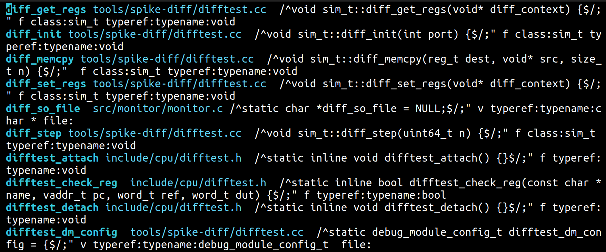
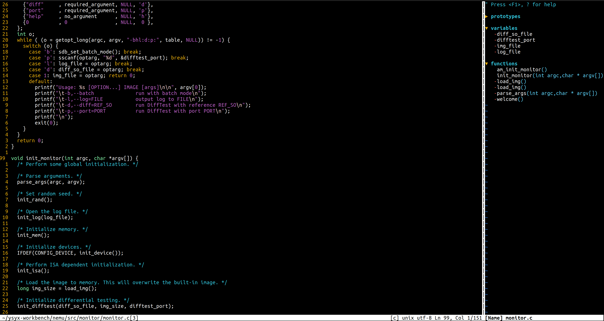

# Editors (Vim)

## 整理人：林睿楠

1. Complete `vimtutor`. Note: it looks best in a [80x24][1] (80 columns by 24 lines) terminal window.

	[1]: <https://en.wikipedia.org/wiki/VT100> "VT100"

	已完成，略．  
	
2. Download our [basic vimrc][2] and save it to `~/.vimrc`. Read through the well-commented file (using Vim!), and observe how Vim looks and behaves slightly differently with the new config.

	[2]: <https://missing.csail.mit.edu/2020/files/vimrc> "basic vimrc file"

	因为我已经有了一个`~/.vimrc`了，所以我会先逐行分析课件给出的文件是什么意思，再看看是否在我自己的`~/.vimrc`中采纳．

	- `set nocompatible`

		首先，什么叫compatible．compatible指的是Vim试图兼容Vi，但实现兼容的同时，Vim一些特有的高级功能将无法使用．所以，一般会在`~/.vimrc`的第一行就设置nocompatible选项，来使能更好的Vim功能．

		但其实，在`~/.vimrc`当中，这一行是多余的．这是因为，在默认情况下，当Vim发现`~/.vimrc`之后，会自动设置为nocompatible，因为设置了`~/.vimrc`一般都想用Vim的功能．在这里，之所以还写上了这一行，是因为这是一种防御性编程行为．事实上，如果并不使用`~/.vimrc`作为初始化配置文件，比如使用`vim -u foo`把foo作为初始化配置文件的时候，就必须写上这一行`set nocompatible`，否则Vim不会默认设置nocompatible．在`~/.vimrc`中写的确在功能上是多余的，但是一种防御性行为．

	- `syntax on`

		这个就是使能语法高亮，具体可用的高亮规则文件可以在/usr/share/vim/vim82/syntax/中查看，例如，你可以看到一些名为c.vim, python.vim, markdown.vim的文件．

		顺便提一句：如何显示在当前的Vim会话中，Vim已经加载了哪些规则？可以在Vim中运行`:scriptnames`即可．

	- `set shortmess+=I`

		shortmess这个选项能够控制Vim能显示什么信息，它的值是一系列单字母的flag，I就是flag之一，作用是隐藏启动介绍信息．当Vim启动时没有给出文件的时候，Vim会给出启动介绍信息，如下图所示：

		

		而当加入了`set shortmess+=I`这行设置之后，当不给文件就启动Vim时，Vim只会给出一片空白，即空的buffer的界面：

		

	- `set number`

		很简单，就是显示行号．

	- `set relativenumber`

		这个东西配合上面的`set number`一起用会非常好用．当仅仅设置了`set number`的时候，显示的行号是绝对行号：

		

		而增设了`set relativenumber`之后，呈现的效果是这样的：

		

		当光标停留在第23行的时候，其他行呈现出来的行号就都是相对于23行的相对行号，这样就能非常方便地使用{count}k或者{count}j的方式来进行上下行的快速移动了．

	- `set laststatus=2`

		总是显示状态栏．laststatus默认的值是1，在这种情况下，状态栏只有在Ctrl+G的时候可以显示．当设置为2之后可以一直显示．

	- `set backspace=indent,eol,start`

		这个是指，在兼容Vi的情况下，Insert模式下的backspace行为有些反常．这一行就是说能让backspace也能删除一些缩进等东西．

		但是，在高版本的Vim中，backspace这个变量的默认值就已经是indent,eol,start了，可以通过运行`:set backspace?`这个命令来验证一下当前的值．这里应该也是作为一项防御性编程．

	- `set hidden`

		在默认情况下，如果你修改了一个buffer并且没有保存，Vim不允许你切换到别的buffer．虽然这可能可以提供一些保护，但是在有些情况下很麻烦．`set hidden`就可以避免掉这个设定．

	- `set ignorecase` && `set smartcase`

		`set ignorecase`就是在搜索的时候忽略大小写．`set smartcase`则是基于`set ignorecase`做了一些改进：如果搜索串是全小写，则在搜索的时候忽略大小写；如果在搜索串中出现了大写，则进行严格匹配，大小写敏感．

	- `set incsearch`

		在搜索的过程中就开始匹配．

	- `nmap Q <Nop>`

		首先，nmap是一个修改映射的命令，意思是迭代地修改对应键在Normal状态下的映射．完整的对映射的介绍参考[这篇StackOverflow问答][3]．在这里，意思是改变大写Q的映射，使得在Normal状态下按下Q，什么都不会发生．

		[3]: <https://stackoverflow.com/questions/3776117/what-is-the-difference-between-the-remap-noremap-nnoremap-and-vnoremap-mapping> "Introduction to different vim mapping commands"

		然后来看原来的Q是什么东西，为什么要取消它的映射．原来的Q是一个Vi留下的很老的功能，叫Ex模式，非常麻烦．为了避免哪天误触到Q，我们需要把它映射成什么都不做．

	- `set noerrorbells visualbell t_vb=`

		当你有一些无效的键入时，默认情况下Vim可能会有一些音效或者视觉上的提示．有些人觉得这些很烦，所以把禁止Vim使用这些提示．

	- `set mouse+=a`

		使能鼠标的使用．a指的是所有的模式下．

	- `nnoremap <Left> :echoe "Use h"<CR>`

		将使用箭头键移动映射成一种报错，从而改掉使用箭头键来移动的坏习惯．`:echoe`是指报错输出．<CR>的作用相当于回车，如果没有它，报错之后你要自己敲回车．  

3. Install and configure a plugin: [ctrlp.vim][4].

	[4]: <https://github.com/ctrlpvim/ctrlp.vim> "ctrlp.vim"

	1. Create the plugins directory with `mkdir -p ~/.vim/pack/vendor/start`

	2. Download the plugin: `cd ~/.vim/pack/vendor/start; git clone https://github.com/ctrlpvim/ctrlp.vim`

	3. Read the [documentation][5] for the plugin. Try using CtrlP to locate a file by navigating to a project directory, opening Vim, and using the Vim command-line to start `:CtrlP`.

		[5]: <https://github.com/ctrlpvim/ctrlp.vim/blob/master/readme.md> "ctrlp documentation"

	4. Customize CtrlP by adding [configuration][6] to your `~/.vimrc` to open CtrlP by pressing Ctrl-P.

		[6]: <https://github.com/ctrlpvim/ctrlp.vim/blob/master/readme.md#basic-options> "ctrlp configuration added to ~/.vimrc"

	第1~2步都是比较简单的，略．接下来对CtrlP这个插件进行一下简要的总结．

	- 三种基本的模式：file，buffers，MRU．file是找当前目录下的文件，buffers是找当前会话打开的其他文件，MRU是找过去打开过的文件．当按下Ctrl+R的时候，默认打开模式是file，可以通过`<c-f>`和`<c-b>`来切换模式．

	- 可以对选中的文件通过分屏打开．`<c-t>`是创建新的tab，`<c-v>`和`<c-x>`是创建新的window．

	- `<c-y>`用来创建一个新文件．

	- `<c-z>`用于多选选中，`<c-o>`是在选中多个文件之后打开它们．

	- 提交`..`可以在原先目录的基础上向上一个目录．

	对于问题的第4条，在仔细研究之后，发现很多配置已经在CtrlP中默认实现了，所以绝大多数都没有写进我的`~/.vimrc`，除了最后一个忽略`.gitignore`中列出文件的：

		  let g:ctrlp_user_command = ['.git', 'cd %s && git ls-files -co --exclude-standard']

	`g:ctrlp_user_command`是一个CtrlP会用到的变量，它是一个list．在使用时，它的意思是：如果在当前目录或者更上层的目录中发现了`.git`，则在呈现搜索结果的时候，使用后面的那条命令．后面那条命令就是列出git文件夹中除了被排除的文件以外的其他文件．  

4. To practice using Vim, re-do the [Demo](https://missing.csail.mit.edu/2020/editors/#demo) from lecture on your own machine.

	略．  

5. Use Vim for *all* your text editing for the next month. Whenevere something seems inefficient, or when you think "there must be a better way", try Googling it, there probably is. If you get stuck, come to office hours or send us an email.

	略．  

6. Configure your other tools to use Vim bindings (see instructions above).

	尝试使用Chrome浏览器的Vim emulation工具[Vimium](https://vimium.github.io/)，发现真的能够极大地提高使用Chrome浏览器的效率．

	尤其是`f/F`，`j`，`k`，`J`，`K`，`T`，`H`，`L`，`m`等一系列操作，真的是极大地简化了浏览器使用时非常常见的一些操作．

	还有就是记住`?`相当于help，可以经常打开来看看．  

7. Further customize your `~/.vimrc` and install more plugins.

	`~/.vimrc`就不说了，已经用得很熟了，也和ysyx里面提供的那个版本融合过了，接下来重点探索一下课件上提到的其他插件．

	1. 首先来看[vim-easymotion](https://github.com/easymotion/vim-easymotion)。
	
		它能让你仅通过敲击键盘上的1~2个键来实现光标的快速移动。
		
		如果你在使用vim的时候不使用vim-easymotion这种插件，那么，当你需要移动光标的时候，你就需要使用`<number>w`或者`<number>f{char}`等命令。即使你使用`set relativenumber`显示了相对行号，你也要在移动的时候用余光看一下相对行号，还要自己键入，况且数字也在键盘上比较远的地方，敲起来还是很麻烦。

		首先总结在不使用自行配置的前提下使用vim-easymotion的方法。使用vim-easymotion，你需要首先键入`<Leader><Leader>`来触发它。紧接着，你需要键入一个动作，例如`w`（以单词为单位移动）或者`fe`（移动到下一个`e`字符处）等。这时，vim-easymotion会将所有符合条件的地方用一个或两个字符标识，只要再键入对应的标识，就可以把光标移动到对应的位置。

		以下是一些频繁配合使用的动作：

		- `w/b`，分别是以单词为单位向后或向前；
		- `f<char>/F<char>/s<char>`，分别是找到后续的`<char>`、前面的`<char>`以及全局u的`<char>`；
		- `j/k`，行跳转，向下或向上；
		
		在以上总结中，可以看到默认情况下的使用有一些问题：

		- `<Leader>`需要键入两遍，这是完全没有必要的；
		- 默认条件下的`<Leader>`是`'\'`，它在键盘上很远的位置；
		- 不能在多个窗口之间跳转；
		- 大小写敏感，事实上大多数情况下，无论大小写都列出来是更加方便的。

		因此，可以在`~/.vimrc`中进行配置：

			" --------------- vim-easymotion ---------------

			" Set vim-easymotion's <Leader> as a space, which has not been mapped and is
			" easy to reach on a keyboard.
			let mapleader = " "

			" Disable default mappings
			let g:EasyMotion_do_mapping = 0

			" Turn on case-insensitive feature
			let g:EasyMotion_smartcase = 1

			" Manually map the motions in order to enable one <Leader> and overwin motions
			nmap <Leader>w <Plug>(easymotion-overwin-w)
			nmap <Leader>e <Plug>(easymotion-e)
			nmap <Leader>b <Plug>(easymotion-b)

			nmap <Leader>j <Plug>(easymotion-j)
			nmap <Leader>k <Plug>(easymotion-k)
			nmap <Leader>l <Plug>(easymotion-lineforward)
			nmap <Leader>h <Plug>(easymotion-linebackward)

			nmap <Leader>f <Plug>(easymotion-overwin-f)
		
		这样就解决了上述提到的问题：

		- <Leader>只用键入一遍；
		- <Leader>改为空格，它很容易触及，并且原来它的映射并不会使用到；
		- <Leader>w和<Leader>f开启了overwin的功能，不仅支持单个窗口中的双向跳转，还支持跨窗口跳转；
		- 开启了smartcase功能，智能匹配大小写。

		在安装上，我把vim-easymotion的GitHub仓库直接克隆在了`~/.vim/pack/plugins/start/`下，`~/.vim/pack/plugins/start/vim-easymotion`。
	
	2. 再来看[NERDTree](https://github.com/preservim/nerdtree)。

		NERDTree能够让你在Vim中打开文件系统的目录，从而更加清晰方便地在Vim中打开文件或进行一些文件操作。

		使用默认操作打开NERDTree时，打开的文件目录是当前Vim所在的目录（Vim也会维护自己的目录）。在这个呈现目录的新窗口中，最基础的命令是`?`键，按下`?`键会弹出使用说明，再按一遍这个使用说明就会回去。

		其他常用的操作列举如下：

		- `o`：对文件，在之前的窗口中打开；对目录，展开或收起；
		- `O`：递归打开目录；
		- `t`：在新的tab中打开文件或展开目录，并跳转到新tab；
		- `T`：在新的tab中打开文件或展开目录，并保持在当前tab不跳转；
		- `i`：在水平新窗口打开文件；
		- `s`：在垂直新窗口打开文件；
		- `x`：收起所在的目录；
		- `I`：显示隐藏文件或目录；
		- `q`：关闭NERDTree。

		默认情况下，需要用`:NERDTree`或者`:NERDTreeToggle`来打开，但是我们可以在`~/.vimrc`中创建快捷映射：

			" Toggle NERDTree on/off in Normal Mode
			nnoremap <F7> :NERDTreeToggle<CR>
		
		这样可以使用F7来打开NERDTree。

		在安装上，我把NERDTree的GitHub仓库直接克隆在了`~/.vim/pack/plugins/start/`下，`~/.vim/pack/plugins/start/nerdtree`。
	
	3. 再看[tagbar](https://github.com/preservim/tagbar)。为了弄清楚tagbar，就必须要先弄清楚[ctags](https://ctags.io/)。

		1. [ctags](https://ctags.io/)

			1. 生成`tags`文件

				ctags分为旧版的Exuberant Ctags和新版的Universal Ctags。我使用的是Unversal Ctags，安装方法是`sudo apt-get install universal-ctags`。

				使用ctags的基本方法是，首先，在你的项目总目录下（例如：`~/ysyx-workbench/nemu/`）运行`ctags -R --exclude=.build .`命令，在该目录下生成一个名叫`tags`的文件。

				`tags`记录了整个项目中出现的所有广义上的变量。例如，下面是一个`tags`文件中截取的片段：

				

				首先，在一个`tags`文件中，最开始出现一些行是元信息。随后，每一行的构成依次是：变量名、变量所在文件、用于搜索到这个变量的模式、变量类型、所属类。`tags`比较重要的一个设计，是采用模式匹配方式定位变量，而非简单使用行号。这就使得当我们为文件简单增加或删除了几行之后，这个模式匹配方式仍然能够精确找到对应的变量。
			
			2. 使用配置文件记录`tags`生成的选项
			
				我们发现，每次更新`tags`文件都需要键入一系列的选项，如`--exclude=.git`等。于是，我们可以考虑创建一个配置文件来写入运行ctags需要的选项。方法是在项目目录下创建配置文件`.ctags.d/settings.ctags`，例如，`~/ysyx-workbench/nemu/.ctags.d/settings.ctags`就是我放在NEMU项目中的配置文件。一个典型的`.settings.ctags`配置文件例子如下：

					# --- 基础设置 ---
					# 递归搜索子目录
					--recursive=yes

					# 排除不需要扫描的目录（提升性能）
					--exclude=.git
					--exclude=.svn
					--exclude=.hg
					--exclude=node_modules
					--exclude=dist
					--exclude=build
					--exclude=log
					--exclude=tmp
					--exclude=vendor
					--exclude=*.min.js
					--exclude=*.map

					# --- 输出格式 ---
					# 记录标签的行号和种类
					--tag-relative=yes
					--fields=+lSznKaf

					# --- 语言特定增强 ---

					# Python：包含类、函数、变量和导入
					--languages=Python
					--python-kinds=+iv

					# JavaScript / TypeScript
					--languages=JavaScript,TypeScript
					--javascript-kinds=+cfmp

					# C / C++：包含函数原型、宏、结构体等
					--language=C,C++
					--c-kinds=+px
					--c++-kinds=+pxz

					# Go
					--languages=Go
					--go-kinds=+fvmst

					# --- 自定义正则表达式（示例：为Markdown添加标题跳转） ---
					--langdef=markdown
					--langmap=markdown:.md
					--regex-markdown=/^# +(.+)/\1/h,heading1/
					--regex-markdown=/^## +(.+)/\1/i,heading2/
					--regex-markdown=/^### +(.+)/\1/j,heading3/
				
				这样，在更新`tags`文件的时候，就只需要键入命令`ctags .`就行了。
			
			3. 让Vim找到`tags`文件

				接下来我们来考虑如何在使用Vim的时候，让Vim找到对应的`tags`文件。为此我们在`~/.vimrc`中写下以下配置信息：

					" Tell Vim where to find tags generated by ctags.
					" ./.tags; means searching for .tags under current file directory and upwards
					" ./tags; means searching for tags under current file directory and upwards
					" tags; means searching for tags under current working directory and upwards
					set tags=./.tags;,./tags;,tags;

				它表示从当前目录开始不断往上寻找`tags`文件，直到找到`tags`文件或者抵达根目录并报错。

			4. Vim中`tags`文件的使用方法

				下面来描述我们如何在Vim中使用`tags`来进行变量定义的跳转。ctags会维持一个栈来记录我们的跳转过程，从而进行向下进一步跳转以及返回的操作。

				- `<C-]>`：当把光标停留在变量之上时，按下`<C-]>`，如果Vim找到`tags`文件并且找到对应匹配行的话，就会跳转到对应文件中的对应行；
				- `<C-t>`：因为ctags维护了一个跳转记录的栈，这个`<C-t>`就是跳回去的方法，往回跳；
				- `g<C-]>`：如果只有一个匹配处，那就跳到那个匹配处，但有的时候，一个变量可能会找到多个“可能”的定义处，此时ctags不能准确判断你想跳转到哪一个定义处，当你使用`g<C-]>`时，ctags会给你列出一个可能的列表让你选择，你只要按下对应的数字再回车就行了；
				- `:tprev`, `:tnext`（或者如果安装了unimpaired插件，对应`]t`和`[t`按键）：当有多个匹配并且已经完成跳转的时候，可以使用这两个在多个匹配的记录之间进行跳转；

		2. [vim-gutentags](https://github.com/ludovicchabant/vim-gutentags)

			我们发现，不用一些工具配合，“裸用”ctags的话，会出现以下问题：

			- 每次改动代码，都要手动更新`tags`文件；
			- 产生的`tags`文件和自己配置的`.ctags.d/settings.ctags`文件会污染项目文件结构。

			所以，就产生了vim-gutentags这个插件。它的核心理念是让`tags`管理像IDE一样全自动且不可见，核心工作原理是：

			- 项目根目录识别：它会通过`.git`、`.hg`、`.svn`等标志自动识别项目的“根”。只有在这些项目目录下的文件，它才会激活。
			- 增量更新：当你保存一个文件时，它不会重新扫描整个项目，而是只更新该文件的`tags`，然后将其合并到现有的`tags`文件中。这使得它在处理超大型代码库时依然极快。
			- 异步运行：它利用Vim8/Neovim的异步任务机制在后台运行ctags。这意味着生成`tags`时，你的Vim完全不会卡顿。
			- 集中存储：它可以把`tags`文件存放在一个集中的缓存目录（如`~/.cache/tags`），而不是污染每个项目的源代码根目录。

			我把vim-gutentags克隆到了`~/.vim/pack/plugins/start/`下。此后，在`~/.vimrc`中添加了如下配置：

				" --------------- vim-gutentags ---------------

				" Search for these to find the root of the project
				let g:gutentags_project_root = ['.root', '.svn', '.git', '.hg', '.project']

				" Automatically generated tags file name
				let g:gutentags_ctags_tagfile = '.tags'

				" Put automatically generated tags files under directory ~/.cache/tags to
				" avoid polluting the project
				let s:vim_tags_path = expand('~/.cache/tags')
				if !isdirectory(s:vim_tags_path)
					silent! call mkdir(s:vim_tags_path, 'p')
				endif
				let g:gutentags_cache_dir = s:vim_tags_path

				" Make vim-gutentags ignore files that have been ignored according to
				" .gitignore
				let g:gutentags_file_list_command = 'git ls-files'

				" Forbid some shortcuts by vim-gutentags
				let g:gutentags_plus_nomap = 1

				" Show when vim-gutentags is generating tags
				set statusline+=%{gutentags#statusline()}

			我们逐个块进行分析：

			- `g:gutentags_project_root`，它指明了根目录标志，即看到这些文件夹的存在，便认定这是根目录。
			- `g:gutentags_ctags_tagfile`，它指出了自动生成的tags的文件名。例如，我的`~/ysyx-workbench/`项目下生成的tags名称就是`~/.cache/tags/home-laotansuan-ysyx-workbench-.tags`。
			- `g:gutentags_cache_dir`，它指出将生成的tags统一放在那个目录下。例如，我设置的就是放在`~/.cache/tags/`下，这样就不会污染项目本身的文件结构，不会在项目本身生成tags文件。
			- `g:gutentags_file_list_command`，它指出了这个项目中有哪些文件是需要用ctags来生成标签的。例如，在git中可以使用`.gitignore`来忽略一些文件，这些文件一般就是ctags不需要进行处理的。使用`git ls-files`可以将所有纳入考虑的文件列出，达到了忽略`.gitignore`中文件的效果。
			- `g:gutentags_plus_nomap`，这是禁用Gutentags Plus中的一些默认快捷键，这使得vim-gutentags的使用不会与已有的快捷键映射冲突，使得`~/.vimrc`中的定义处于顶端。
			- `set statusline+=%{gutentags#statusline()}`，它使得Vim能在底部状态栏实时显示vim-gutentags的当前工作状态，来看什么时候它在后台更新tags文件。

			那么问题来了：使用vim-gutentags之后还需要在`~/.vimrc`中设置`set tags=`这个配置吗？vim-gutentags会把`~/.cache/tags/`下的tags文件放在搜索的第一位，但是如果没有搜到，并且在`~/.vimrc`中有相应设置的话，就可以使用`~/.vimrc`中的设置进行下一步的搜索。所以，还是有必要设置的，使得既能找到vim-gutentags自动设置的标签，也能找到手动设置的标签（例如，当一个项目没有使用git进行版本管理时）。

			`.ctags.d/settings.ctags`倒是不再需要了。
		
		3. [tagbar](https://github.com/preservim/tagbar)

			这个插件能够借助tags文件，展现当前操作文件中的标签及其组织结构，并实现快速跳转。我仍然把它克隆在`~/.vim/pack/plugins/start/`下。

			tagbar的默认打开方式是输入`:TagbarToggle`。我们可以在`~/.vimrc`中把它映射到`F8`：

				" Map tagbar to <F8>
				nmap <F8> :TagbarToggle<CR>
			
			下面这张图呈现的是`~/ysyx-workbench/nemu/src/monitor/monitor.c`中打开tagbar呈现出的内容：

			

			tagbar的使用按`?`就可以呈现，比较简单，就不总结了。
