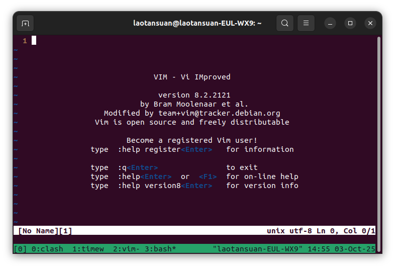
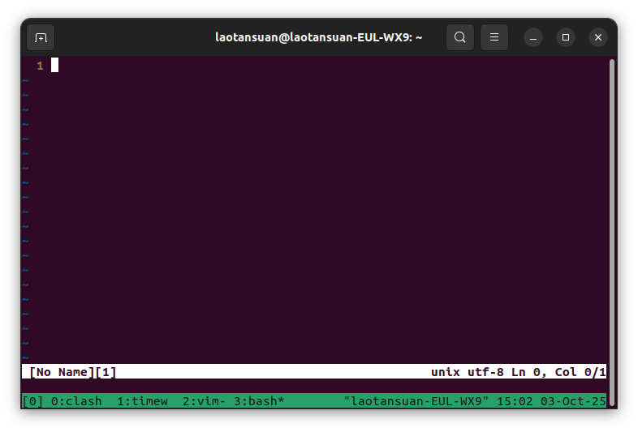
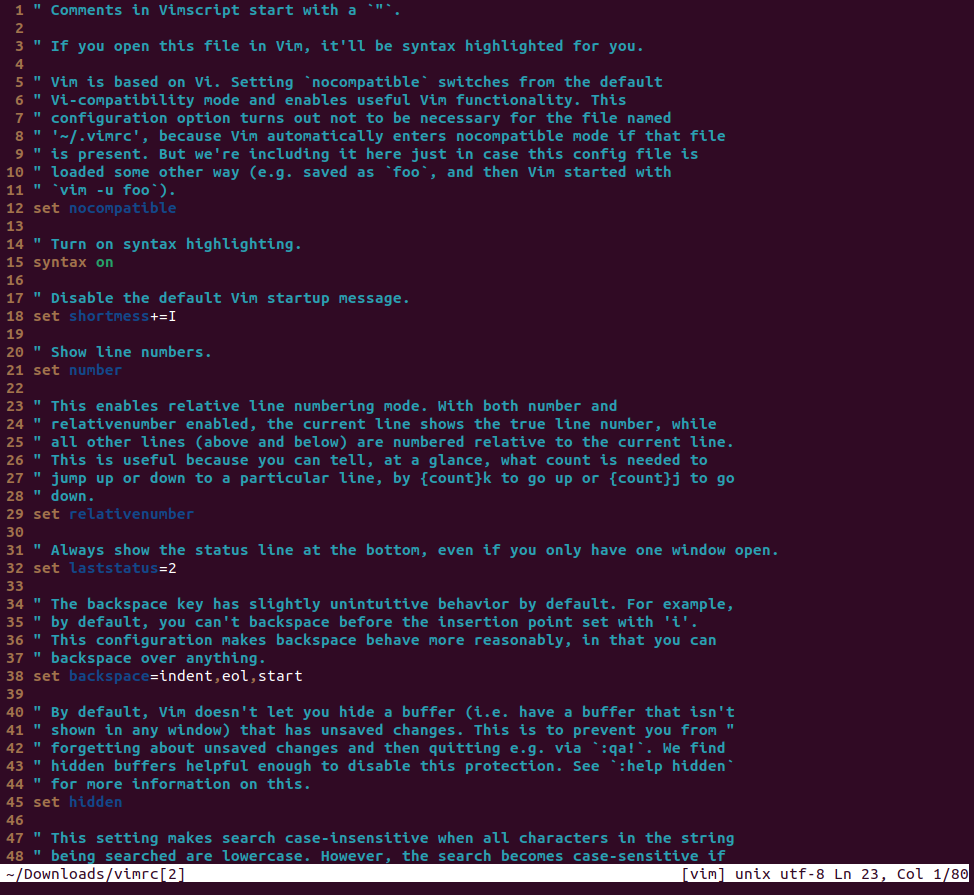
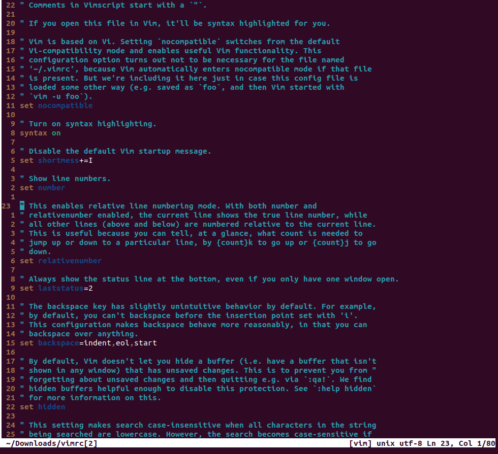

# Editors (Vim)

## 整理人：林睿楠

1. Complete `vimtutor`. Note: it looks best in a [80x24][1] (80 columns by 24 lines) terminal window.

	[1]: <https://en.wikipedia.org/wiki/VT100> "VT100"

	已完成，略．  
	
2. Download our [basic vimrc][2] and save it to `~/.vimrc`. Read through the well-commented file (using Vim!), and observe how Vim looks and behaves slightly differently with the new config.

	[2]: <https://missing.csail.mit.edu/2020/files/vimrc> "basic vimrc file"

	因为我已经有了一个`~/.vimrc`了，所以我会先逐行分析课件给出的文件是什么意思，再看看是否在我自己的`~/.vimrc`中采纳．

	- `set nocompatible`

		首先，什么叫compatible．compatible指的是Vim试图兼容Vi，但实现兼容的同时，Vim一些特有的高级功能将无法使用．所以，一般会在`~/.vimrc`的第一行就设置nocompatible选项，来使能更好的Vim功能．

		但其实，在`~/.vimrc`当中，这一行是多余的．这是因为，在默认情况下，当Vim发现`~/.vimrc`之后，会自动设置为nocompatible，因为设置了`~/.vimrc`一般都想用Vim的功能．在这里，之所以还写上了这一行，是因为这是一种防御性编程行为．事实上，如果并不使用`~/.vimrc`作为初始化配置文件，比如使用`vim -u foo`把foo作为初始化配置文件的时候，就必须写上这一行`set nocompatible`，否则Vim不会默认设置nocompatible．在`~/.vimrc`中写的确在功能上是多余的，但是一种防御性行为．

	- `syntax on`

		这个就是使能语法高亮，具体可用的高亮规则文件可以在/usr/share/vim/vim82/syntax/中查看，例如，你可以看到一些名为c.vim, python.vim, markdown.vim的文件．

		顺便提一句：如何显示在当前的Vim会话中，Vim已经加载了哪些规则？可以在Vim中运行`:scriptnames`即可．

	- `set shortmess+=I`

		shortmess这个选项能够控制Vim能显示什么信息，它的值是一系列单字母的flag，I就是flag之一，作用是隐藏启动介绍信息．当Vim启动时没有给出文件的时候，Vim会给出启动介绍信息，如下图所示：

		

		而当加入了`set shortmess+=I`这行设置之后，当不给文件就启动Vim时，Vim只会给出一片空白，即空的buffer的界面：

		

	- `set number`

		很简单，就是显示行号．

	- `set relativenumber`

		这个东西配合上面的`set number`一起用会非常好用．当仅仅设置了`set number`的时候，显示的行号是绝对行号：

		

		而增设了`set relativenumber`之后，呈现的效果是这样的：

		

		当光标停留在第23行的时候，其他行呈现出来的行号就都是相对于23行的相对行号，这样就能非常方便地使用{count}k或者{count}j的方式来进行上下行的快速移动了．

	- `set laststatus=2`

		总是显示状态栏．laststatus默认的值是1，在这种情况下，状态栏只有在Ctrl+G的时候可以显示．当设置为2之后可以一直显示．

	- `set backspace=indent,eol,start`

		这个是指，在兼容Vi的情况下，Insert模式下的backspace行为有些反常．这一行就是说能让backspace也能删除一些缩进等东西．

		但是，在高版本的Vim中，backspace这个变量的默认值就已经是indent,eol,start了，可以通过运行`:set backspace?`这个命令来验证一下当前的值．这里应该也是作为一项防御性编程．

	- `set hidden`

		在默认情况下，如果你修改了一个buffer并且没有保存，Vim不允许你切换到别的buffer．虽然这可能可以提供一些保护，但是在有些情况下很麻烦．`set hidden`就可以避免掉这个设定．

	- `set ignorecase` && `set smartcase`

		`set ignorecase`就是在搜索的时候忽略大小写．`set smartcase`则是基于`set ignorecase`做了一些改进：如果搜索串是全小写，则在搜索的时候忽略大小写；如果在搜索串中出现了大写，则进行严格匹配，大小写敏感．

	- `set incsearch`

		在搜索的过程中就开始匹配．

	- `nmap Q <Nop>`

		首先，nmap是一个修改映射的命令，意思是迭代地修改对应键在Normal状态下的映射．完整的对映射的介绍参考[这篇StackOverflow问答][3]．在这里，意思是改变大写Q的映射，使得在Normal状态下按下Q，什么都不会发生．

		[3]: <https://stackoverflow.com/questions/3776117/what-is-the-difference-between-the-remap-noremap-nnoremap-and-vnoremap-mapping> "Introduction to different vim mapping commands"

		然后来看原来的Q是什么东西，为什么要取消它的映射．原来的Q是一个Vi留下的很老的功能，叫Ex模式，非常麻烦．为了避免哪天误触到Q，我们需要把它映射成什么都不做．
